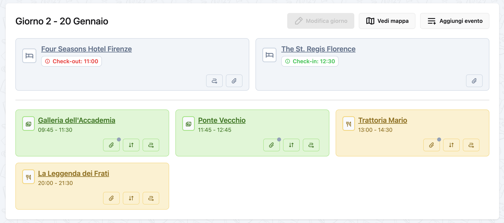

# Days

Days are the organizational units of your trip. They are automatically generated based on your trip's start and end dates and contain all the events planned for each specific day.

## What is a Day?

A **Day** represents a single calendar day within your trip. Each day:

- Has a **number** (Day 1, Day 2, etc.)
- Has a **specific date** (e.g., Friday, March 14, 2025)
- Contains **events** (experiences, meals, transfers)
- Can have **one stay** (accommodation)
- Is **automatically generated** from trip dates

## How Days Are Created

Days are created and managed automatically by the system based on your trip dates.

### Automatic Generation

When you create a trip with:
- **Start Date**: March 14, 2025 (Friday)
- **End Date**: March 16, 2025 (Sunday)

The system automatically creates:
- **Day 1**: Friday, March 14, 2025
- **Day 2**: Saturday, March 15, 2025
- **Day 3**: Sunday, March 16, 2025

!!! info "You Cannot Manually Create Days"
    Days cannot be created, edited, or deleted manually. They are always auto-generated from the trip's start and end dates.

### Updating Days

Days update automatically when you:

#### Extend the Trip
**Before**: 3 days (Mar 14-16)
**Change**: End date to Mar 18
**Result**: 2 new days created (Day 4, Day 5)

#### Shorten the Trip
**Before**: 5 days (Mar 14-18)
**Change**: End date to Mar 16
**Result**: Days 4 and 5 are deleted

!!! warning "Data Loss"
    When days are deleted, all events on those days become "unpaired" and need to be reassigned or deleted.

#### Change Start Date
**Before**: Days start on Mar 14
**Change**: Start date to Mar 15
**Result**: All days shift forward, Day 1 is now Mar 15

## Day Structure

### Day Number

Each day has a sequential number starting from 1:
- Day 1 = First day of trip
- Day 2 = Second day of trip
- Day 3 = Third day of trip
- etc.

The day number never changes unless you modify the trip dates.

### Day Date

Each day corresponds to a specific calendar date:
- Day 1 might be "Friday, March 14, 2025"
- Day 2 might be "Saturday, March 15, 2025"

The date is displayed along with the day number for clarity.

### Events on a Day

Each day can contain multiple events:

- **Experiences**: Museums, tours, walks, attractions
- **Meals**: Breakfast, lunch, dinner, snacks
- **Transfers**: Arrival, departure, moving between locations

Events are displayed in chronological order based on their start time.

### Stay on a Day

Each day can have **one accommodation (stay)** associated with it:

- Stays can span multiple consecutive days
- The same stay appears on all days it covers
- Example: A 3-night hotel from Day 1 to Day 3 appears on Days 1, 2, and 3

## Viewing Days

### From Trip Overview

The trip detail page shows all days in order:

1. Day header (number + date)
2. Stay information (if assigned)
3. All events for that day
4. Quick action buttons (Add Experience, Add Meal, etc.)

### Day Detail View

Click on a day to view:

- Complete timeline of events
- Event details with expand/collapse
- Overlap warnings (if events conflict)
- Navigation to previous/next day
- Quick actions to add events

### Day Navigation

When viewing a day, you can:
- Click **← Previous Day** to go back
- Click **Next Day →** to go forward
- Click the trip title to return to trip overview

!!! tip "Keyboard Navigation"
    Use arrow keys to navigate between days (if implemented in future)

## Events Within Days


*A day with its events in timeline view*

### Timeline View

Events are displayed in chronological order:

```
Day 1 - Friday, March 14, 2025
─────────────────────────────────
Stay: Hotel Forum Roma (Check-in: 15:00)

08:00 - Flight to Rome (Arrival)
12:00 - Train to hotel (Transfer)
16:00 - Colosseum Tour (Experience)
19:30 - Trattoria da Enzo (Meal)
```

### Overlapping Events

The system detects when events overlap in time:

!!! warning "Time Conflict"
    Experience at 16:00-18:00 overlaps with Meal at 17:30

Review and adjust event times to avoid conflicts.

### Unpaired Events

Events without a day assignment appear in a special "Unpaired Events" section at the bottom of the trip page. You can:

1. Edit the event
2. Assign it to a specific day
3. Save

## Managing Events by Day

### Adding Events to a Day

From the day view or trip overview:

1. Find the day you want to add to
2. Click the appropriate "Add" button:
   - **Add Experience** - for activities
   - **Add Meal** - for restaurants
   - **Add Transfer** - for transportation
   - **Add Stay** - for accommodation

3. Fill in the event details
4. The event automatically belongs to that day

### Moving Events Between Days

To move an event from one day to another:

1. Click on the event to open details
2. Click **Edit**
3. Change the **Day** field to a different day
4. Click **Save**

The event now appears on the new day.

### Removing Events from a Day

To remove an event:

**Option 1: Delete permanently**
1. Click on the event
2. Click **Delete**
3. Confirm deletion

**Option 2: Unpair (keep but unassign)**
1. Edit the event
2. Set day to "None" or "Unpaired"
3. Save

The event moves to "Unpaired Events" section.

## Day Display Options

### Collapsed View (Trip Overview)

Shows:
- Day number and date
- Number of events
- Stay name (if any)
- Quick action buttons

### Expanded View (Day Detail)

Shows:
- Full timeline
- All event details
- Event times and durations
- Event descriptions and notes
- Overlap warnings

## Best Practices

### Planning by Day

✅ **Do**:
- Group related events together
- Leave buffer time between events
- Consider travel time between locations
- Check for time overlaps

❌ **Don't**:
- Over-schedule days with back-to-back events
- Forget to account for meals
- Ignore travel time
- Skip rest periods

### Realistic Scheduling

A well-planned day might look like:

```
Day 2 - Saturday
─────────────────
09:00 - Breakfast at hotel
10:00 - Museum visit (2 hours)
13:00 - Lunch (1.5 hours)
15:00 - Walking tour (2 hours)
18:00 - Free time / rest
20:00 - Dinner reservation
```

Notice:
- ✅ Meals included
- ✅ Reasonable event durations
- ✅ Buffer time between events
- ✅ Free time for spontaneity

### Managing Multi-Day Stays

When a stay spans multiple days:

1. Set the stay's start day and end day
2. The stay appears on all covered days
3. Check-in time shows on first day
4. Check-out time shows on last day

Example:
```
Day 1: Hotel ABC (Check-in: 15:00)
Day 2: Hotel ABC (staying)
Day 3: Hotel ABC (Check-out: 11:00)
```

## Day Statistics

Each day may display:

- **Total events**: Number of planned activities
- **First event time**: When your day starts
- **Last event time**: When your day ends
- **Free time**: Gaps in the schedule

!!! tip "Balance Your Days"
    A good mix of activities and free time makes for a more enjoyable trip.

## Frequently Asked Questions

### Can I create custom days?

No, days are always auto-generated from trip dates. If you need an extra day, extend the trip's end date.

### What happens to events when I delete a day?

Events on deleted days become "unpaired" and appear in the Unpaired Events section. You can reassign them to other days or delete them.

### Can I reorder days?

No, days are always in chronological order based on date. You cannot manually reorder them.

### Can a day have no events?

Yes, days don't require events. You might have rest days or days with spontaneous plans.

### Can I rename days?

No, days are automatically named "Day 1", "Day 2", etc. The system shows both the number and the calendar date.

### Can I add notes to a specific day?

Currently, notes are added to individual events, not to days themselves. Add a note to an event or stay for day-specific information.

### How do I see all events for today?

When viewing a trip during your travel dates, the current day is highlighted. Click on it to see all events.

### Can I print a day's itinerary?

Day/trip printing is planned for a future release. For now, you can use your browser's print function on the day detail page.

## Related Guides

- [Trips](trips.md) - Understanding the trip container
- [Stays](stays.md) - Adding accommodations to days
- [Experiences](experiences.md) - Planning activities for each day
- [Meals](meals.md) - Scheduling meals throughout the day
- [Transfers](transfers.md) - Managing transportation between days

---

**Next**: Learn about [adding stays to your days](stays.md)
