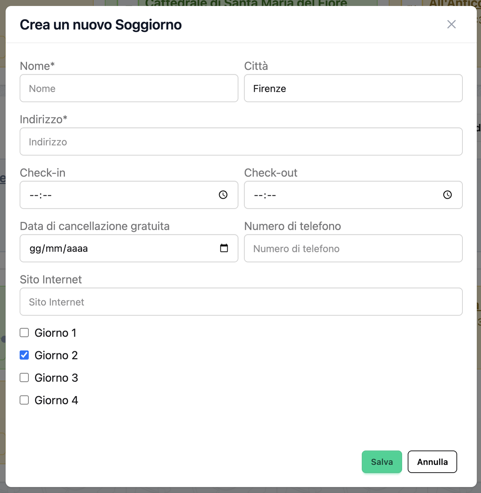

# Stays

Stays represent your accommodations during the trip - hotels, apartments, hostels, or any place where you'll be staying overnight.

## What is a Stay?

A **Stay** is an accommodation that spans one or more consecutive days in your trip. Stays can include:

- Hotels
- Apartments/Airbnb
- Hostels
- Guest houses
- Vacation rentals
- Friends' or family's homes

## Creating a Stay

### From Day View

1. Navigate to the day where the stay begins
2. Click **Add Stay**
3. Fill in the stay details
4. Click **Save**

### From Trip Overview

1. Find the day section
2. Click **Add Stay** in that day's card
3. Fill in details
4. Save


*The stay creation form*

## Stay Fields

### Required Fields

**Name**
- The accommodation name
- Example: "Hotel Forum Roma", "Sarah's Apartment", "Hilton Downtown"
- Max 100 characters

**Address**
- Full street address
- Example: "Via Tor de' Conti, 25, 00184 Rome, Italy"
- Used for geocoding and map display
- Max 200 characters

**Start Day**
- The first day of your stay
- Example: Day 1

**End Day**
- The last day of your stay
- Must be on or after the start day
- Example: Day 3

### Optional Fields

**Check-in Time**
- When you can access the accommodation
- Example: 15:00, 14:00
- Displayed on the first day only

**Check-out Time**
- When you must vacate
- Example: 11:00, 12:00
- Displayed on the last day only

**City**
- City name
- Auto-populated during geocoding
- Max 100 characters

**Phone Number**
- Contact number for the accommodation
- Example: "+39 06 1234 5678"
- Can be auto-filled via Google Places enrichment
- Max 50 characters

**Website**
- Accommodation website URL
- Example: "https://www.hotelforum.com"
- Can be auto-filled via Google Places enrichment

**Cancellation Date**
- Last date for free cancellation
- Useful reminder for booking flexibility
- Example: March 1, 2025

**Confirmation Number**
- Booking reference or confirmation code
- Example: "HTL123456", "ABC-2025-0314"

**Notes**
- Additional information
- Example: "Free breakfast included. Pool on 5th floor. Late check-out arranged."
- Max 500 characters

## Multi-Day Stays

Stays can span multiple consecutive days, which is typical for most accommodations.

### How Multi-Day Stays Work

When you create a stay from Day 1 to Day 3:
- The stay appears on Days 1, 2, and 3
- Check-in time shows on Day 1
- Check-out time shows on Day 3
- The same stay object is linked to all covered days

### Example

```
Trip: Rome Weekend (Mar 14-16)

Day 1 - Friday, Mar 14
├─ Stay: Hotel Forum Roma
│  └─ Check-in: 15:00

Day 2 - Saturday, Mar 15
├─ Stay: Hotel Forum Roma

Day 3 - Sunday, Mar 16
├─ Stay: Hotel Forum Roma
   └─ Check-out: 11:00
```

### Changing Stay Duration

To extend or shorten a stay:

1. Edit the stay
2. Change the **End Day** field
3. Save

The stay will automatically appear on (or be removed from) the affected days.

## Multiple Stays in One Trip

If you're moving between different accommodations during your trip, create separate stays:

### Example: Two Hotels

```
Day 1-2: Hotel in Rome
Day 3-4: Hotel in Florence
Day 5: Hotel in Venice
```

Each stay:
1. Has its own dates
2. Has its own location
3. Shows on the appropriate days
4. Has separate check-in/out times

!!! tip "Plan Check-out to Check-in"
    Leave enough time between check-out from one stay and check-in to the next. Add a transfer between them if needed.

## Location and Maps

### Geocoding

When you enter an address, Organize It automatically:

1. Converts the address to coordinates (latitude/longitude)
2. Determines the city
3. Validates the location

This enables:
- Map display
- Distance calculations
- Location-based features

### Viewing on Map

Stays are displayed on maps in:
- Day detail view
- Trip overview map (if implemented)
- Event timeline with location markers

!!! info "Geocoding Accuracy"
    For best results, use complete addresses with street name, number, postal code, and country.

## Google Places Enrichment

Organize It can auto-fill stay details using Google Places API.

### What is Enrichment?

Enrichment automatically fetches:
- Official website URL
- Phone number
- Opening hours (if applicable)
- Additional place data

### How to Enrich a Stay

1. Create or edit a stay with a valid address
2. Click **Enrich** button
3. The system searches Google Places for the address
4. Select the correct result
5. Details are automatically filled in

!!! note "API Key Required"
    Google Places enrichment requires a configured API key. Check with your administrator if this feature is unavailable.

### Enriched Data Fields

After enrichment:
- ✅ `place_id` - Google Places identifier
- ✅ `website` - Official website
- ✅ `phone_number` - Contact number
- ✅ `opening_hours` - Reception hours (if available)
- ✅ `enriched` flag set to true

## Managing Stays

### Editing a Stay

1. Click on the stay card
2. Click **Edit**
3. Modify any field
4. Click **Save**

Changes apply to all days the stay covers.

### Deleting a Stay

1. Click on the stay card
2. Click **Delete**
3. Confirm deletion

!!! warning "Deletion Impact"
    Deleting a stay removes it from all days it was assigned to. This action cannot be undone.

### Moving a Stay to Different Days

1. Edit the stay
2. Change **Start Day** and/or **End Day**
3. Save

The stay will move to the new day range.

## Best Practices

### Booking Information

✅ **Include**:
- Confirmation numbers
- Cancellation dates
- Special requests (early check-in, late check-out)
- Important notes (parking, breakfast, amenities)

### Complete Addresses

✅ **Good address**:
```
Via Tor de' Conti, 25
00184 Rome, Italy
```

❌ **Incomplete address**:
```
Hotel Forum Roma
```

Complete addresses enable proper geocoding and map display.

### Check-in/out Times

- Always include check-in and check-out times
- Set reminders if you need early check-in or late check-out
- Note standard times in the Notes field
- Example note: "Standard check-in 15:00, requested early check-in at 12:00"

### Using Notes Effectively

Good notes include:
- Parking instructions
- WiFi passwords (if known in advance)
- Amenities (pool, gym, breakfast)
- Special arrangements
- Contact person name
- Backup phone numbers

Example:
```
Free parking in rear lot. WiFi: hotelguest / password123.
Pool open 7am-10pm. Breakfast buffet 7-10am included.
Contact: Marco (front desk) +39 123 456 7890
```

## Stay Display

### On Day Cards

Shows:
- Stay name
- Check-in time (first day only)
- Check-out time (last day only)
- "Staying" indicator (middle days)

### On Day Detail Page

Shows:
- Complete stay information
- Address with map
- Check-in/out times
- All notes and details
- Edit/delete actions

### On Maps

Shows:
- Pin marker at stay location
- Stay name on hover
- Click to view full details

## Frequently Asked Questions

### Can I have multiple stays on the same day?

No, each day can only have one stay. If you're changing accommodations mid-day, assign one stay to that day and the other to the next day. Use a transfer to represent the move.

### What happens if I delete a day that has a stay?

If you shorten a trip and delete days, the stay will be adjusted:
- If only middle days are deleted: Stay becomes non-consecutive (not recommended, edit manually)
- If the last day is deleted: Stay end date moves to the new last day
- If all days are deleted: The stay is removed

### Can I create a stay that doesn't belong to any day?

No, stays must always be assigned to at least one day (start day and end day).

### How do I handle same-day check-in and check-out?

Set both **Start Day** and **End Day** to the same day. This represents a single-night stay where you check in and out on the same calendar day (e.g., Day 3).

### Can I add multiple locations for a stay?

No, each stay has one address. If you have multiple room bookings at different properties, create separate stay entries.

### Why isn't my address geocoding correctly?

Try:
- Adding more detail (street number, postal code, country)
- Using official address format from Google Maps
- Checking for typos
- Using English transliterations for non-Latin addresses

### Can I attach documents to a stay?

Currently, document attachments are not supported. You can:
- Add links to confirmation emails (via Trip Links)
- Add confirmation numbers in the field
- Add file URLs in notes

## Related Guides

- [Days](days.md) - Understanding day organization
- [Trips](trips.md) - Managing trips
- [Transfers](transfers.md) - Moving between stays
- [Experiences](experiences.md) - Activities near your stay

---

**Next**: Learn about [adding experiences to your days](experiences.md)
