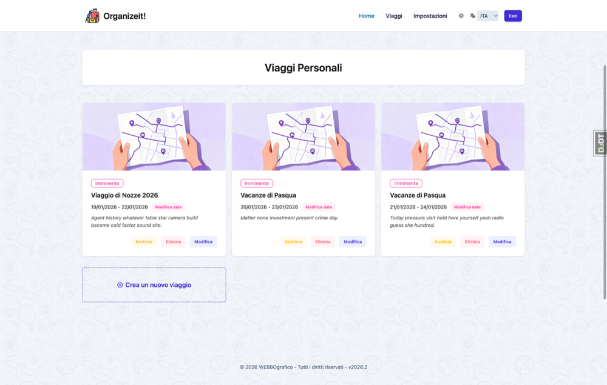

# Benvenuto in Organize It

**Organize It** è una potente applicazione web progettata per aiutarti a pianificare e gestire i tuoi viaggi con facilità.

*I tuoi viaggi organizzati in un unico posto*

## Cos'è Organize It?

Organize It ti aiuta a creare itinerari di viaggio dettagliati organizzando tutti gli aspetti del tuo viaggio in un unico posto:

- **Viaggi** - Piani di viaggio completi con aggiornamenti automatici dello stato
- **Giorni** - Programmi giornalieri generati automaticamente
- **Alloggi** - Gestione di hotel e sistemazioni
- **Esperienze** - Attività, musei, tour e attrazioni
- **Pasti** - Prenotazioni ristoranti e piani per i pasti
- **Trasferimenti** - Voli, treni e trasporti

## Caratteristiche Principali

### 🗓️ Generazione Automatica dei Giorni
I giorni vengono creati automaticamente dalle date del viaggio. Cambia le date e l'itinerario si aggiorna automaticamente.

### ⏰ Rilevamento Conflitti di Orario
Il sistema ti avvisa quando gli eventi si sovrappongono, aiutandoti a creare programmi realistici.

### 🏨 Alloggi Multi-Giorno
Le sistemazioni possono coprire più giorni consecutivi e appaiono automaticamente su tutti i giorni pertinenti.

### 🗺️ Integrazione con le Mappe
Gli indirizzi vengono geocodificati automaticamente con supporto per l'arricchimento Google Places e la visualizzazione su mappa.

### 🖼️ Immagini Bellissime
Carica le tue immagini di copertina o cerca su Unsplash direttamente dall'app.

### 📱 Design Responsivo
Funziona perfettamente su desktop, tablet e dispositivi mobili.

## Link Rapidi

-   :material-rocket-launch:{ .lg .middle } __Per Iniziare__

    ---

    Nuovo su Organize It? Inizia qui!

    [:octicons-arrow-right-24: Guida all'Installazione](getting-started/installation.md)

    [:octicons-arrow-right-24: Guida Rapida](getting-started/quick-start.md)

-   :material-book-open-variant:{ .lg .middle } __Guida Utente__

    ---

    Scopri tutte le funzionalità in dettaglio.

    [:octicons-arrow-right-24: Viaggi](user-guide/trips.md)

    [:octicons-arrow-right-24: Giorni](user-guide/days.md)

    [:octicons-arrow-right-24: Alloggi](user-guide/stays.md)

-   :material-help-circle:{ .lg .middle } __Serve Aiuto?__

    ---

    Domande comuni e risoluzione problemi.

    [:octicons-arrow-right-24: Domande Frequenti](faq.md)

-   :material-github:{ .lg .middle } __Open Source__

    ---

    Contribuisci o segnala problemi su GitHub.

    [:octicons-arrow-right-24: Repository GitHub](https://github.com/applewebbo/organize_it)

## Stack Tecnologico

Organize It è costruito con tecnologie web moderne:

- **Backend**: Django 6.0+, Python 3.14+
- **Frontend**: TailwindCSS, HTMX, Alpine.js
- **Database**: PostgreSQL (produzione), SQLite (sviluppo)
- **Mappe**: Mapbox, Folium
- **Immagini**: Integrazione API Unsplash

## Inizia in 5 Minuti

1. **[Installa Organize It](getting-started/installation.md)** - Configura l'applicazione
2. **[Crea il tuo primo viaggio](getting-started/first-trip.md)** - Segui il nostro tutorial dettagliato
3. **[Esplora le funzionalità](user-guide/trips.md)** - Scopri tutte le capacità

## Contribuire

Organize It è open source! I contributi sono benvenuti:

- Segnala bug o richiedi funzionalità su [GitHub Issues](https://github.com/applewebbo/organize_it/issues)
- Invia pull request per migliorare il codice
- Migliora la documentazione
- Condividi il tuo feedback

## Licenza

Controlla il [repository GitHub](https://github.com/applewebbo/organize_it) per informazioni sulla licenza.

---

**Pronto per iniziare?** Vai alla [Guida all'Installazione](getting-started/installation.md) per far funzionare Organize It sul tuo computer!
