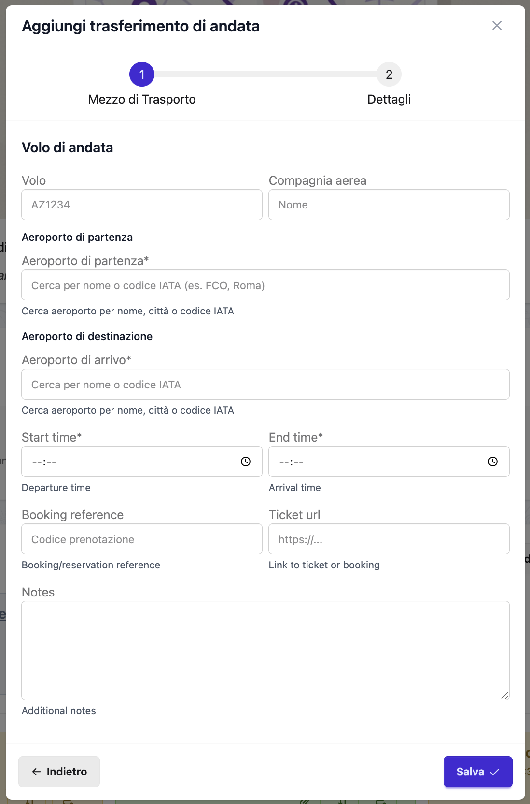

# Trasferimenti

I trasferimenti rappresentano tutti i trasporti durante il tuo viaggio - da voli e treni a camminate tra attrazioni. Organize It ti aiuta a tracciare arrivi, partenze e spostamenti tra destinazioni.

## Cos'è un Trasferimento?

Un **Trasferimento** è qualsiasi spostamento da una posizione all'altra durante il tuo viaggio. Ci sono tre tipi:

1. **Trasferimenti Principali** - Arrivo e partenza (voli, treni da/verso destinazione)
2. **Trasferimenti tra Alloggi** - Spostamento tra diverse sistemazioni
3. **Trasferimenti Semplici** - Spostamento tra eventi nello stesso giorno

## Trasferimenti Principali

I trasferimenti principali gestiscono il tuo viaggio da e verso la destinazione del viaggio.

### Trasferimento di Arrivo

Il tuo viaggio VERSO la destinazione all'inizio del viaggio.

**Esempi**:
- Volo da Londra a Roma
- Treno da Parigi a Barcellona
- Guida da casa a casa vacanza

### Trasferimento di Partenza

Il tuo viaggio DA la destinazione alla fine del viaggio.

**Esempi**:
- Volo da Roma verso Londra
- Treno da Barcellona a Parigi
- Guida da casa vacanza verso casa


*Il form di creazione trasferimento*

### Creare un Trasferimento Principale

1. Naviga al viaggio
2. Clicca **Aggiungi Trasferimento** → **Arrivo** o **Partenza**
3. Compila i dettagli del trasferimento
4. Clicca **Salva**

### Campi Trasferimento Principale

#### Campi Obbligatori

**Tipo di Trasporto**
- Tipo di trasportazione
- Opzioni:
  - **Aereo** - Voli, trasporto aereo
  - **Treno** - Trasporto ferroviario
  - **Auto** - Veicolo personale, auto a noleggio
  - **Altro** - Bus, barca, ecc.

**Direzione**
- **Arrivo** - Arrivo alla destinazione
- **Partenza** - Partenza dalla destinazione

**Ora Inizio** (Ora partenza)
- Quando parti dall'origine
- Esempio: 08:00, 14:30

**Ora Fine** (Ora arrivo)
- Quando arrivi a destinazione
- Esempio: 11:30, 18:45

#### Origine e Destinazione

**Per Aereo e Treno**:
- **Codice Origine** - Codice IATA (aereo) o ID stazione (treno)
  - Esempio: LHR, FCO, NYP, GCT
- **Nome Origine** - Nome completo aeroporto/stazione
  - Esempio: "London Heathrow", "Roma Fiumicino"
- **Codice Destinazione** - Codice IATA o ID stazione
- **Nome Destinazione** - Nome completo aeroporto/stazione

**Per Auto e Altro**:
- **Indirizzo Origine** - Indirizzo completo
- **Indirizzo Destinazione** - Indirizzo completo

#### Campi Opzionali

**Riferimento Prenotazione**
- Numero di conferma
- Esempio: "BA123456", "EUROSTAR-2025-0314"

**URL Biglietto**
- Link a e-ticket o prenotazione
- Esempio: "https://www.airline.com/tickets/ABC123"

**Note**
- Dettagli aggiuntivi
- Esempio: "Posto 12A. Check-in apre 24h prima. Bagaglio: 1x23kg incluso."

**Dati Specifici per Tipo** (campo JSON per flessibilità)
- Numero volo (es. "BA500")
- Nome compagnia aerea
- Numero treno
- Informazioni binario
- Dettagli terminal

### Esempi Trasferimento Principale

#### Arrivo con Volo

```
Tipo: Aereo
Direzione: Arrivo
Origine: LHR (London Heathrow)
Destinazione: FCO (Roma Fiumicino)
Ora Partenza: 08:00
Ora Arrivo: 11:30
Riferimento Prenotazione: BA123456
Note: British Airways BA500. Posto 12A. Terminal 5.
      Check-in online 24h prima. Bagaglio 1x23kg incluso.
Dati Specifici per Tipo:
  - numero_volo: BA500
  - compagnia_aerea: British Airways
  - terminal: 5
```

#### Arrivo con Treno

```
Tipo: Treno
Direzione: Arrivo
Origine: Gare de Lyon (Parigi)
Destinazione: Milano Centrale (Milano)
Ora Partenza: 14:15
Ora Arrivo: 21:25
Riferimento Prenotazione: THELLO-2025-0314
Note: Treno notte Thello. Cabina letto #12. Binario 3.
Dati Specifici per Tipo:
  - numero_treno: TH9426
  - compagnia: Thello
  - cabina: 12
```

#### Partenza con Auto

```
Tipo: Auto
Direzione: Partenza
Indirizzo Origine: Via Esempio 123, Città Vacanza, CA 12345
Indirizzo Destinazione: Via Casa 456, Città Casa, CA 54321
Ora Partenza: 10:00
Ora Arrivo: 16:00
Note: Viaggio 6 ore. Sosta pranzo a metà strada. Restituzione noleggio in aeroporto.
```

## Connessioni Trasferimenti Principali

Dopo l'arrivo a destinazione (aeroporto, stazione) o prima della partenza, devi spostarti da/verso il tuo primo/ultimo evento o alloggio. Le Connessioni Trasferimenti Principali semplificano questo creando un collegamento rapido tra il tuo trasferimento principale e la prima/ultima destinazione.

### Cos'è una Connessione Trasferimento Principale?

Una **Connessione Trasferimento Principale** è un tipo speciale di trasferimento che collega:

1. **Per Arrivo**: Destinazione trasferimento principale → Primo evento o alloggio
2. **Per Partenza**: Ultimo evento o alloggio → Origine trasferimento principale

Questo ti aiuta a pianificare "l'ultimo miglio" del tuo arrivo e il "primo miglio" della tua partenza.

### Quando Usare le Connessioni Trasferimenti Principali

**Connessione Arrivo** - Crea quando:
- Devi spostarti da aeroporto/stazione al tuo primo hotel
- Vuoi andare direttamente dall'arrivo alla tua prima attività
- Hai bisogno di tracciare il trasporto dal punto di arrivo alla prima destinazione

**Connessione Partenza** - Crea quando:
- Devi spostarti dal tuo ultimo hotel all'aeroporto/stazione
- La tua ultima attività non è vicina al punto di partenza
- Vuoi pianificare il viaggio verso il tuo trasporto di partenza

**Scenari Esempio**:

```
Arrivo:
Aeroporto Roma Fiumicino → Hotel Forum Roma (primo alloggio)
- Connessione: Treno + Metro, 45 minuti

Partenza:
Hotel Brunelleschi (ultimo alloggio) → Stazione Firenze SMN
- Connessione: A piedi, 15 minuti
```

### Creare una Connessione Trasferimento Principale

1. Naviga al viaggio
2. Assicurati di aver creato:
   - Un trasferimento principale (arrivo o partenza)
   - Almeno un evento o alloggio
3. Nella sezione **Trasferimenti Principali**, trova il tuo arrivo/partenza
4. Clicca sul pulsante **Aggiungi Connessione**
5. Seleziona destinazione (evento o alloggio)
6. Scegli modalità trasporto
7. Aggiungi note opzionali
8. Salva

### Campi Connessione Trasferimento Principale

**Modalità Trasporto**
- Come stai viaggiando da/verso il trasferimento principale
- Opzioni:
  - **Guida** - Taxi, auto a noleggio, Uber
  - **A piedi** - Brevi distanze a piedi
  - **Bicicletta** - Bici, noleggio e-scooter
  - **Mezzi Pubblici** - Metro, bus, treno, navetta

**Note** (Opzionale)
- Dettagli aggiuntivi sulla connessione
- Esempio: "Treno Airport Express per Termini, poi Metro Linea B per Colosseo. Totale: 45 min. Treno ogni 15 min."

### Esempi Connessione Trasferimento Principale

#### Arrivo - Aeroporto a Hotel

```
Trasferimento Principale: Volo BA500 (LHR → FCO)
Destinazione: Hotel Forum Roma (primo alloggio)

Connessione:
Modalità Trasporto: Mezzi Pubblici
Note: Treno Leonardo Express per Roma Termini (32 min, €14).
      Metro Linea B da Termini a Colosseo (8 min).
      Camminata a hotel (5 min).
      Viaggio totale: ~45 minuti
      Treno ogni 15 min, 6:23 - 23:23
```

#### Arrivo - Aeroporto a Prima Attività

```
Trasferimento Principale: Volo AF1234 (CDG → FCO)
Destinazione: Tour Colosseo (primo evento, 14:00)

Connessione:
Modalità Trasporto: Guida
Note: Taxi prenotato da Fiumicino al Colosseo.
      Tariffa fissa €48. Autista: Marco +39 123 456 7890
      Viaggio: ~40 minuti (dipende dal traffico)
      Punto incontro: Arrivi Terminal 3
```

#### Partenza - Hotel ad Aeroporto

```
Ultimo Alloggio: Hotel Brunelleschi (Firenze)
Trasferimento Principale: Volo per Londra (partenza 16:00)

Connessione:
Modalità Trasporto: A piedi
Note: Camminata 15 minuti da hotel a stazione Firenze SMN.
      Poi taxi per aeroporto (20 min, ~€25-30)
      Parcheggio taxi fuori entrata principale stazione
      Permetti 1 ora totale per connessione
```

#### Partenza - Ultima Attività a Stazione

```
Ultimo Evento: Pranzo d'addio alla Trattoria Mario (12:00)
Trasferimento Principale: Treno per Milano (partenza 15:30)

Connessione:
Modalità Trasporto: A piedi
Note: Camminata 20 minuti da ristorante a Firenze SMN.
      Percorso panoramico attraverso mercato San Lorenzo
      Arriva in stazione entro le 15:00 per check-in
```

### Gestire le Connessioni

**Modificare una Connessione**:
1. Clicca sulla connessione nella sezione Trasferimenti Principali
2. Modifica modalità trasporto o note
3. Salva

**Eliminare una Connessione**:
1. Clicca **Modifica** sulla connessione
2. Clicca **Elimina**
3. Conferma eliminazione

**Cambiare Destinazione**:
- Elimina la connessione esistente
- Crea una nuova connessione con destinazione diversa

### Best Practice

**Per Connessioni Arrivo**:

✅ **Permetti sempre tempo extra**:
- Voli internazionali: 90-120 min per dogana + bagagli
- Voli domestici: 45-60 min per ritiro bagagli
- Treni: 15-30 min per uscire dalla stazione
- Aggiungi 30% extra per ritardi/non familiarità

✅ **Considera i bagagli**:
- Camminare con valigie? Mantienilo breve (<15 min)
- Bagagli pesanti? Scegli taxi/Uber invece di mezzi pubblici
- Più valigie? Prenota il trasporto in anticipo

✅ **Ricerca opzioni trasporto**:
- Verifica se disponibili navette aeroporto/stazione
- Confronta: taxi vs. mezzi pubblici vs. auto a noleggio
- Nota orari operativi (arrivi notturni?)

**Per Connessioni Partenza**:

✅ **Lavora a ritroso dall'ora partenza**:
```
Partenza volo: 16:00
Arrivo raccomandato: 13:00 (3h prima volo intl)
Durata connessione: 45 min (hotel ad aeroporto)
Devi lasciare hotel entro: 12:15 (con margine)
```

✅ **Pianifica per caso peggiore**:
- Ritardi traffico (ora di punta mattina/sera)
- Perdersi o prendere direzione sbagliata
- Attesa taxi/trasporto
- Aggiungi 50% margine per partenze

✅ **Verifica disponibilità trasporto**:
- La metro è operativa abbastanza presto?
- Il taxi è disponibile a quell'ora?
- Dovresti prenotare in anticipo?

**Contenuto Note**:

Includi nelle note connessione:
- Numeri esatti linea/percorso (Metro Linea B, Bus 64)
- Durata per ogni segmento
- Prezzi biglietti
- Orari operativi/frequenza
- Opzioni alternative se principale fallisce
- Numeri contatto per trasporto prenotato
- Punti incontro/luoghi ritiro

### Suggerimenti

!!! tip "Non Complicare Troppo"
    Crea connessioni solo se richiedono pianificazione. Se prendi un taxi da aeroporto a hotel, una semplice nota nel trasferimento principale può bastare.

!!! tip "Primo Alloggio vs. Primo Evento"
    Solitamente connetti al tuo primo **alloggio** (sistemazione). Connetti al primo **evento** solo se vai direttamente a un'attività prima del check-in.

!!! tip "Usa per Connessioni Complesse"
    Più utile quando la connessione coinvolge:
    - Più modalità trasporto (treno + metro + camminata)
    - Prenotazione richiesta
    - Vincoli temporali specifici
    - Percorsi non familiari in città straniere

## Trasferimenti tra Alloggi

Spostamento tra diverse sistemazioni durante il tuo viaggio.

### Quando Usare i Trasferimenti tra Alloggi

Crea un trasferimento tra alloggi quando:
- Cambi hotel a metà viaggio
- Ti sposti da una città all'altra
- Passi da hotel a casa vacanza

**Scenario Esempio**:
```
Giorno 1-3: Hotel a Roma
Giorno 4: Giorno di viaggio - Spostamento a Firenze
Giorno 5-7: Hotel a Firenze
```

Aggiungi un trasferimento tra alloggi dall'hotel di Roma all'hotel di Firenze il Giorno 4.

### Creare un Trasferimento tra Alloggi

1. Naviga al giorno in cui ti stai spostando
2. Clicca **Aggiungi Trasferimento** → **Trasferimento tra Alloggi**
3. Seleziona:
   - **Da Alloggio**: Sistemazione attuale
   - **A Alloggio**: Prossima sistemazione
4. Compila i dettagli
5. Salva

### Campi Trasferimento tra Alloggi

**Da Alloggio**
- La sistemazione che stai lasciando
- Auto-popolato con ora checkout

**A Alloggio**
- La sistemazione dove ti stai spostando
- Auto-popolato con ora check-in

**Modalità Trasporto**
- Come stai viaggiando
- Opzioni:
  - **Guida** - Auto, taxi, noleggio
  - **A piedi** - A piedi (brevi distanze)
  - **Bicicletta** - Bici, e-scooter
  - **Mezzi Pubblici** - Trasporto pubblico (bus, metro, treno)

**Ora Partenza** (opzionale)
- Quando lasci il primo alloggio
- Spesso corrisponde all'ora checkout

**Ora Arrivo** (opzionale)
- Quando raggiungi il prossimo alloggio
- Dovrebbe essere prima dell'ora check-in

**Note**
- Informazioni aggiuntive
- Esempio: "Taxi prenotato. €50 tariffa fissa. Autista: Marco +39 123 456 7890"

### Esempio Trasferimento tra Alloggi

```
Da Alloggio: Hotel Forum Roma
A Alloggio: Hotel Brunelleschi (Firenze)
Modalità Trasporto: Mezzi Pubblici
Ora Partenza: 11:00 (dopo checkout)
Ora Arrivo: 14:30 (prima check-in 15:00)
Note: Treno da Roma Termini a Firenze SMN.
      Freccia Rossa #9352. Prenotazione: TRENITALIA-123456
      Metro per Termini da hotel (20 min)
      Camminata da SMN a hotel (15 min)
      Viaggio totale: ~3.5 ore
```

## Trasferimenti Semplici

Spostamenti rapidi tra eventi nello stesso giorno.

### Quando Usare i Trasferimenti Semplici

Crea trasferimenti semplici per:
- Camminata tra museo e ristorante
- Taxi da pranzo ad attività pomeridiana
- Corsa in metro tra due attrazioni

### Creare un Trasferimento Semplice

1. Naviga a un giorno
2. Clicca **Aggiungi Trasferimento** → **Trasferimento Semplice**
3. Seleziona:
   - **Da Evento**: Punto di partenza
   - **A Evento**: Destinazione
4. Scegli modalità trasporto
5. Aggiungi note se necessario
6. Salva

### Campi Trasferimento Semplice

**Da Evento**
- L'evento che stai lasciando
- Auto-popolato con posizione

**A Evento**
- L'evento dove stai andando
- Auto-popolato con posizione

**Modalità Trasporto**
- Come stai viaggiando
- Opzioni stesse dei trasferimenti tra alloggi:
  - Guida, A piedi, Bicicletta, Mezzi Pubblici

**Note**
- Informazioni aggiuntive
- Esempio: "Camminata 15 minuti lungo il fiume. Percorso panoramico."

### Funzionalità Trasferimenti Semplici

#### Link Google Maps Auto-Generato

I trasferimenti semplici generano automaticamente un URL Google Maps:
- Usa indirizzi di entrambi gli eventi
- Include modalità trasporto selezionata
- Clicca per aprire indicazioni in Google Maps

#### Timeline Visuale

I trasferimenti semplici appaiono tra eventi nella timeline del giorno:

```
12:00 - Pranzo da Roscioli (Pasto)
    ↓ [A piedi - 10 min]
14:00 - Tour Colosseo (Esperienza)
    ↓ [Metro - 20 min]
17:00 - Cena a Trastevere (Pasto)
```

### Esempi Trasferimenti Semplici

#### A Piedi

```
Da Evento: Museo del Louvre
A Evento: Café de Flore (Pranzo)
Modalità Trasporto: A piedi
Note: Camminata panoramica 20 minuti lungo la Senna.
      Attraversa Pont des Arts.
```

#### Metro/Mezzi Pubblici

```
Da Evento: Tour Colosseo
A Evento: Musei Vaticani
Modalità Trasporto: Mezzi Pubblici
Note: Metro Linea A (Colosseo → Ottaviano).
      15 minuti + 5 min camminata all'ingresso Vaticano.
      Compra biglietti in anticipo.
```

#### Taxi/Guida

```
Da Evento: Cena al Ristorante
A Evento: Hotel (fine giornata)
Modalità Trasporto: Guida
Note: Taxi. Circa €15-20. 10 minuti.
      Usa Uber o fermalo per strada.
```

## Modalità di Trasporto

### Guida
- Auto personale
- Auto a noleggio
- Taxi/Uber/Lyft
- Autista privato

**Migliore per**: Lunghe distanze, più fermate, bagagli pesanti, gruppi

### A Piedi
- A piedi
- Brevi distanze

**Migliore per**: Posizioni vicine (<20 min camminata), turismo lungo il percorso, bel tempo

### Bicicletta
- Bicicletta
- E-bike
- Noleggio scooter

**Migliore per**: Distanze medie, città bike-friendly, evitare traffico

### Mezzi Pubblici
- Metro/metropolitana
- Bus
- Tram
- Treni locali
- Traghetto

**Migliore per**: Città con buoni trasporti pubblici, evitare parcheggio, economico

## Gestire i Trasferimenti

### Modificare un Trasferimento

1. Clicca sul trasferimento
2. Clicca **Modifica**
3. Modifica i campi
4. Salva

### Eliminare un Trasferimento

1. Clicca sul trasferimento
2. Clicca **Elimina**
3. Conferma eliminazione

!!! warning
    Eliminare un trasferimento è permanente.

### Visualizzare sulle Mappe

I trasferimenti con dati posizione appaiono su:
- Mappe timeline giorno
- Mappe panoramica viaggio
- Visualizzazione percorso (da → a)

## Best Practice

### Pianificazione Trasferimenti Principali

✅ **Includi sempre**:
- Trasferimenti arrivo e partenza
- Conferme prenotazioni
- Orari partenza e arrivo
- Requisiti check-in
- Franchigie bagaglio

**Esempio checklist**:
```
✓ Volo prenotato
✓ Posti selezionati
✓ Promemoria check-in online (24h prima)
✓ Regole bagaglio annotate
✓ Parcheggio aeroporto/trasporto organizzato
✓ Numeri conferma registrati
```

### Tempo Extra

Lascia tempo adeguato tra:

**Dopo trasferimento arrivo**:
- Dogana/immigrazione (internazionale): 60-90 min
- Ritiro bagagli: 30-45 min
- Trasporto all'hotel: Variabile
- **Extra prima del primo evento**: minimo 2-3 ore

**Prima trasferimento partenza**:
- Voli internazionali: Arriva 3 ore prima
- Voli domestici: Arriva 2 ore prima
- Treni: Arriva 30-45 min prima
- **Ultimo evento dovrebbe finire**: 4-5 ore prima del volo

**Tra alloggi**:
- Permetti tempo per checkout (hotel può tenere bagagli)
- Tempo viaggio + 30% extra
- Tempo prima check-in (deposita bagagli se presto)

### Best Practice Note

**Per voli, includi**:
```
Compagnia: British Airways
Volo: BA500
Partenza: Terminal 5, Gate apre 1h prima
Posto: 12A (finestrino)
Bagaglio: 1x23kg registrato, 1x10kg mano
Check-in: Online 24h prima
Conferma: BA123456
```

**Per treni, includi**:
```
Compagnia: Trenitalia
Treno: Freccia Rossa #9352
Binario: TBD (controlla 20 min prima)
Posto: Carrozza 5, Posto 22A
Prenotazione: TRENITALIA-123456
```

**Per trasferimenti tra alloggi, includi**:
```
Checkout: 11:00 (bagagli tenuti da hotel fino 14:00)
Trasporto: Taxi prenotato, €50 fisso
Autista: Marco +39 123 456 7890
Lascia presso: Nuovo hotel, Via Esempio 123
Arrivo: ~14:30 (check-in 15:00)
```

### Pianificazione Trasferimenti Semplici

Non creare trasferimenti per:
- ❌ Eventi nello stesso edificio
- ❌ Posizioni adiacenti (<2 min camminata)
- ❌ Connessioni molto ovvie

Crea trasferimenti per:
- ✅ Quartieri diversi
- ✅ Trasporti richiedenti biglietti/prenotazione
- ✅ Percorsi necessitanti istruzioni specifiche

## Calcoli Tempo

### Stimare Durata Trasferimento

**A piedi**: ~5 km/h (3 mph)
- 1 km = ~12 minuti
- 1 miglio = ~20 minuti

**Guida (città)**: ~30 km/h (20 mph) con traffico
- 5 km = ~10 minuti
- 3 miglia = ~10 minuti

**Metro/Mezzi Pubblici**: Variabile
- Controlla percorsi specifici
- Aggiungi tempo attesa (5-10 min)
- Aggiungi camminata da/verso stazioni

**Taxi/Uber**: Simile a guida
- Aggiungi tempo attesa ritiro (5-15 min)

!!! tip "Aggiungi 30% Extra"
    Aggiungi sempre tempo extra per ritardi imprevisti, perdersi, o viaggi lenti.

## Domande Frequenti

### Posso avere più trasferimenti arrivo/partenza?

Ogni viaggio può avere un trasferimento arrivo e uno partenza. Se hai più voli (con coincidenze), aggiungi dettagli coincidenza nelle note.

### Come gestisco le coincidenze voli?

Aggiungi dettagli coincidenza nelle note:
```
Note: LHR → FCO (diretto)
      Opzione coincidenza: Cambio a CDG
      Se ritardo, volo riserva: BA502 (2 ore dopo)
```

### Posso tracciare trasporto stazione-hotel?

Sì! Usa un trasferimento semplice:
```
Da Evento: Arrivo a Roma Termini (endpoint trasferimento arrivo)
A Evento: Check-in Hotel (primo alloggio)
Modalità Trasporto: Metro
Note: Linea B verso Colosseo. 10 minuti.
```

### Dovrei aggiungere trasferimenti per ogni spostamento?

No. Aggiungi trasferimenti solo quando:
- Posizioni/quartieri diversi
- Trasporto specifico necessario
- Pianificazione tempo/percorso importante

Salta per:
- Stesso edificio
- Posizioni adiacenti
- Percorsi pedonali ovvi

### Come gestisco auto a noleggio?

**Ritiro**:
```
Tipo: Auto (Noleggio)
Direzione: Arrivo (se parte dell'arrivo)
Note: Enterprise Rent-A-Car. Ritiro in aeroporto.
      Conferma: ENT-123456. Assicurazione completa inclusa.
      Restituzione: Giorno 7, stessa posizione.
```

**Restituzione**:
Includi nelle note trasferimento partenza o crea evento separato.

### Posso allegare biglietti/conferme?

Attualmente, no allegati file diretti. Opzioni:
- Aggiungi **URL Biglietto** per e-ticket
- Usa sezione **Link** viaggio per pagine prenotazione
- Memorizza numeri conferma nelle note

### Come traccio viaggi multi-tratta?

**Opzione 1**: Un trasferimento con note dettagliate
```
Note: Viaggio multi-tratta:
      1. Treno: Roma → Firenze (2h)
      2. Cambio a Firenze (1h attesa)
      3. Treno: Firenze → Venezia (2h)
      Totale: 5 ore
```

**Opzione 2**: Eventi separati per ogni tratta (se pernottamento tra)

## Guide Correlate

- [Alloggi](stays.md) - Gestione sistemazioni
- [Giorni](days.md) - Organizzazione programmi giornalieri
- [Esperienze](experiences.md) - Pianificazione attività
- [Viaggi](trips.md) - Panoramica viaggio

---

**Prossimo**: Visita la [sezione FAQ](../faq.md) per domande comuni
