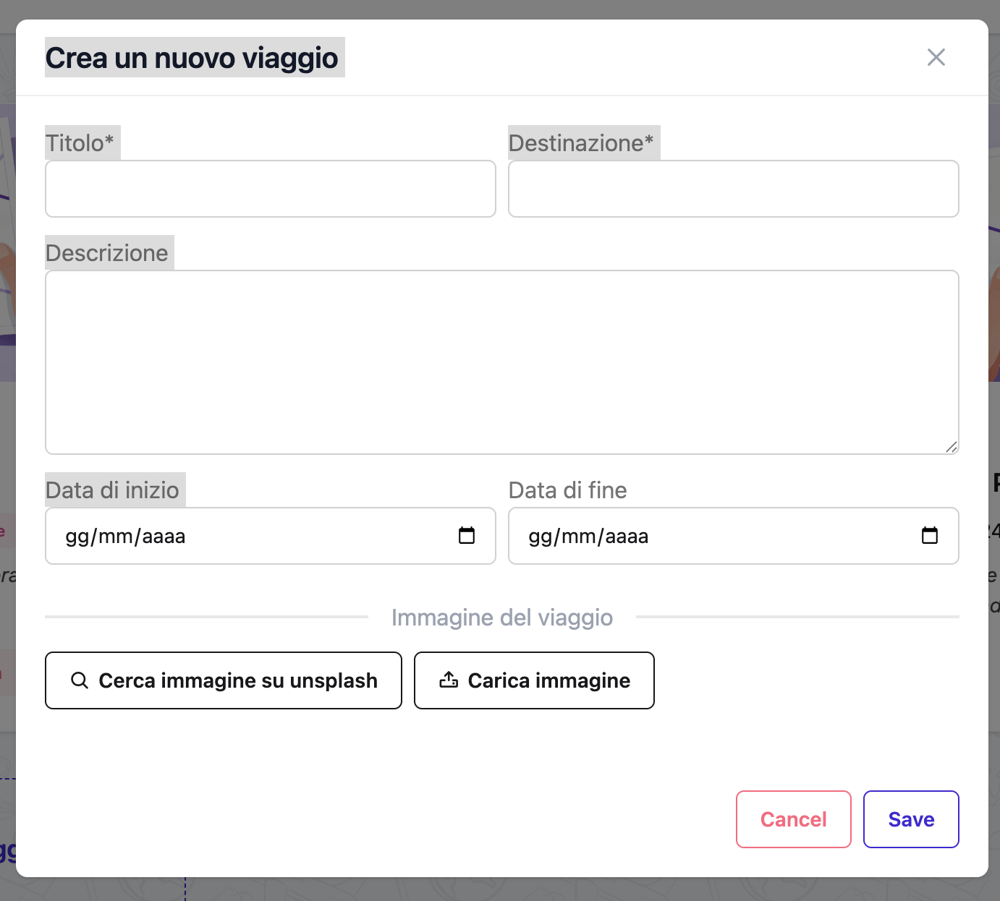

# Viaggi

I viaggi sono la base di Organize It. Un viaggio rappresenta un piano di viaggio completo con tutti i tuoi alloggi, attività, pasti e trasporti organizzati per giorno.

## Cos'è un Viaggio?

Un **Viaggio** è un contenitore per tutta la tua pianificazione di viaggio. Ogni viaggio include:

- **Informazioni di base**: Titolo, destinazione, date, descrizione
- **Giorni**: Generati automaticamente in base alle date di inizio e fine
- **Eventi**: Attività, pasti e trasporti organizzati per giorno
- **Alloggi**: Sistemazioni (hotel, appartamenti, ecc.)
- **Link**: URL utili relativi al viaggio
- **Immagine di copertina**: Una rappresentazione visiva della tua destinazione
- **Stato**: Aggiornato automaticamente in base alle date

## Creare un Viaggio


*La lista dei tuoi viaggi nella homepage*

### Dalla Homepage

1. Clicca il pulsante **Crea Nuovo Viaggio**
2. Compila i dettagli del viaggio
3. Clicca **Salva**


*Il form di creazione viaggio*

### Dettagli del Viaggio

#### Campi Obbligatori

- **Titolo**: Un nome descrittivo per il tuo viaggio
  - Esempio: "Estate in Italia", "Viaggio di Lavoro a Tokyo", "Weekend a Parigi"
  - Massimo 100 caratteri

- **Destinazione**: Dove stai andando
  - Esempio: "Roma, Italia", "Tokyo, Giappone", "Parigi, Francia"
  - Massimo 100 caratteri

- **Data Inizio**: Primo giorno del viaggio
- **Data Fine**: Ultimo giorno del viaggio

!!! warning "Validazione Date"
    La data di fine deve essere uguale o successiva alla data di inizio.

#### Campi Opzionali

- **Descrizione**: Dettagli aggiuntivi sul viaggio
  - Massimo 500 caratteri
  - Esempio: "Una settimana rilassante esplorando l'antica Roma con la famiglia"

- **Immagine di Copertina**: Rappresentazione visiva
  - Carica la tua immagine (max 2MB, orientamento orizzontale consigliato)
  - Oppure cerca e usa foto Unsplash direttamente

## Stati del Viaggio

Organize It aggiorna automaticamente lo stato del viaggio in base alle date. Non puoi cambiare manualmente lo stato (tranne per Archiviare).

### Tipi di Stato

| Stato | Quando | Descrizione |
|--------|------|-------------|
| **Non Iniziato** | La data di inizio è più di 7 giorni nel futuro | Il viaggio è nel futuro |
| **Imminente** | La data di inizio è entro 7 giorni | Il viaggio sta per iniziare |
| **In Corso** | Tra le date di inizio e fine | Il viaggio è in svolgimento |
| **Completato** | Dopo la data di fine | Il viaggio è terminato |
| **Archiviato** | Impostato manualmente | Il viaggio è archiviato e nascosto dalla vista principale |

### Transizioni di Stato

Il sistema aggiorna automaticamente gli stati:

```
Non Iniziato → Imminente (7 giorni prima dell'inizio)
         ↓
    In Corso (alla data di inizio)
         ↓
     Completato (dopo la data di fine)
         ↓
     Archiviato (manuale)
```

!!! tip "Archiviare Viaggi"
    Archivia i viaggi completati per mantenere pulita la tua lista viaggi. I viaggi archiviati possono essere visualizzati in una sezione separata.

## Gestire i Viaggi

### Modificare un Viaggio

1. Vai alla pagina dettaglio viaggio
2. Clicca **Modifica Viaggio**
3. Modifica qualsiasi campo
4. Clicca **Salva**

!!! info "Date e Giorni"
    Se cambi le date di inizio o fine, i giorni verranno rigenerati automaticamente. Gli eventi esistenti verranno riassegnati al giorno corrispondente più vicino.

### Eliminare un Viaggio

1. Vai alla pagina dettaglio viaggio
2. Clicca **Elimina Viaggio**
3. Conferma l'eliminazione

!!! danger "Eliminazione Permanente"
    Eliminare un viaggio eliminerà anche tutti i giorni, eventi e alloggi associati. Questa azione non può essere annullata.

### Archiviare un Viaggio

1. Vai alla pagina dettaglio viaggio
2. Clicca **Archivia**
3. Lo stato del viaggio diventa "Archiviato" e viene nascosto dalla lista principale

Per visualizzare i viaggi archiviati:
- Usa il menu a tendina filtri sulla homepage
- Seleziona "Mostra Viaggi Archiviati"

### Preferire Viaggi

Contrassegna i viaggi importanti come preferiti:

1. Vai alla pagina dettaglio viaggio
2. Clicca l'icona stella
3. I viaggi preferiti appaiono in cima alla tua lista

!!! tip "Accesso Rapido"
    I viaggi preferiti vengono visualizzati in modo prominente sulla homepage per un accesso rapido.

## Immagini di Copertina

### Caricare la Tua Immagine

1. Clicca **Carica Immagine** nel modulo viaggio
2. Seleziona un'immagine dal tuo computer
3. Le immagini vengono ridimensionate e ottimizzate automaticamente

**Raccomandazioni**:
- Usa orientamento orizzontale (16:9 o 4:3)
- Dimensione file massima: 2MB
- Formati supportati: JPG, PNG, WebP

### Usare Immagini Unsplash

Organize It si integra con Unsplash per fornire bellissime foto stock gratuite:

1. Clicca **Cerca su Unsplash** nel modulo viaggio
2. Inserisci un termine di ricerca (es. "paris eiffel tower")
3. Sfoglia i risultati
4. Clicca su un'immagine per visualizzare l'anteprima
5. Clicca **Usa Questa Foto**

!!! info "Attribuzione"
    Quando usi foto Unsplash, l'attribuzione del fotografo viene visualizzata automaticamente sulla tua pagina viaggio come richiesto dai Termini di Servizio di Unsplash.

**Formato Attribuzione**:
```
Photo by [Nome Fotografo] on Unsplash
```

### Cambiare un'Immagine

Puoi cambiare l'immagine di copertina in qualsiasi momento:

1. Modifica il viaggio
2. Carica una nuova immagine o cerca di nuovo su Unsplash
3. La vecchia immagine verrà sostituita

### Rimuovere un'Immagine

1. Modifica il viaggio
2. Seleziona la casella "Cancella immagine"
3. Salva

## Giorni del Viaggio

I giorni vengono generati automaticamente quando crei o modifichi un viaggio con date.

### Come Funzionano i Giorni

- **Generati automaticamente**: In base alle date di inizio e fine
- **Numerati sequenzialmente**: Giorno 1, Giorno 2, Giorno 3, ecc.
- **Consapevoli della data**: Ogni giorno ha una data calendario specifica
- **Contenitori di eventi**: Ogni giorno può contenere più eventi

### I Giorni si Aggiornano Automaticamente

Quando:
- Cambi la data di inizio → I giorni si spostano di conseguenza
- Cambi la data di fine → I giorni vengono aggiunti o rimossi
- Estendi il viaggio → Vengono creati nuovi giorni
- Accorci il viaggio → I giorni extra vengono eliminati

!!! warning "Accorciare i Viaggi"
    Se accorci un viaggio, i giorni fuori dal nuovo intervallo di date verranno eliminati insieme ai loro eventi. Assicurati di rivedere i tuoi eventi prima di accorciare le date.

## Link del Viaggio

Aggiungi link utili relativi al tuo viaggio per un riferimento rapido.

### Aggiungere Link

1. Vai alla pagina dettaglio viaggio
2. Scorri fino alla sezione Link
3. Clicca **Aggiungi Link**
4. Compila:
   - **Titolo**: Nome descrittivo
   - **URL**: Indirizzo web completo
   - **Descrizione** (opzionale): Contesto aggiuntivo

### Esempi di Link

Link utili da aggiungere:
- Conferme prenotazione voli
- Pagine prenotazione hotel
- Conferme prenotazione tour
- Email prenotazione ristoranti
- Documenti assicurazione viaggio
- Pagine informazioni visto
- Guide di destinazione
- Previsioni meteo
- Mappe

### Gestire i Link

- **Modifica**: Clicca il link e modifica i dettagli
- **Elimina**: Clicca il pulsante elimina
- **Apri**: Clicca l'URL per visitare in una nuova scheda

## Pagina Panoramica Viaggio

La pagina dettaglio viaggio mostra:

### Sezione Intestazione
- Titolo e destinazione viaggio
- Immagine di copertina (se impostata)
- Badge stato
- Intervallo date
- Icona stella preferiti
- Pulsanti modifica ed elimina

### Sezione Giorni
- Tutti i giorni in ordine cronologico
- Eventi organizzati sotto ogni giorno
- Informazioni alloggio (se applicabile)
- Pulsanti "Aggiungi evento" per ogni giorno

### Sezione Statistiche (se disponibile)
- Numero totale di eventi
- Numero di alloggi
- Numero di trasferimenti
- Durata viaggio

### Sezione Link
- Tutti i link salvati
- Pulsante aggiungi nuovo link

### Sezione Eventi Non Associati
- Eventi non assegnati ad alcun giorno
- Possono essere assegnati successivamente

## Best Practice

### Nominare i Viaggi

✅ Buoni esempi:
- "Roma e Firenze - Primavera 2025"
- "Viaggio Lavoro Tokyo (Q2)"
- "Weekend a Barcellona"

❌ Evita:
- "Viaggio 1", "Il Mio Viaggio" (non descrittivo)
- Titoli molto lunghi che non stanno nelle card

### Usare le Descrizioni

Aggiungi contesto che ti aiuta a ricordare lo scopo del viaggio:
- "Vacanza annuale in famiglia con i bambini"
- "Viaggio conferenza + turismo"
- "Luna di miele - fuga romantica"

### Organizzare Più Viaggi

- Usa i preferiti per i prossimi viaggi importanti
- Archivia regolarmente i vecchi viaggi
- Usa titoli chiari e ricercabili
- Aggiungi l'anno ai viaggi ricorrenti nella stessa destinazione

### Cronologia di Pianificazione

1. **3+ mesi prima**: Crea viaggio, aggiungi voli/hotel
2. **1-2 mesi prima**: Ricerca e aggiungi attività principali
3. **2-4 settimane prima**: Aggiungi prenotazioni ristoranti
4. **1 settimana prima**: Finalizza i programmi giornalieri
5. **Durante il viaggio**: Contrassegna eventi come completati, aggiungi note

## Domande Frequenti

### Posso avere viaggi senza date?

No, le date di inizio e fine sono obbligatorie. I giorni sono generati automaticamente dalle date e il sistema di stati si basa su di esse.

### Posso duplicare un viaggio?

Attualmente non c'è una funzione di duplicazione. Devi creare un nuovo viaggio e aggiungere manualmente gli eventi. (Richiesta funzionalità: #XX)

### Posso condividere viaggi con altri?

Non ancora. La condivisione viaggi è pianificata per una versione futura. (Richiesta funzionalità: #XX)

### Quanti viaggi posso creare?

Non c'è limite al numero di viaggi che puoi creare.

### Posso esportare il mio viaggio?

L'esportazione viaggi (PDF, ICS) è pianificata per una versione futura. (Richiesta funzionalità: #XX)

### Cosa succede agli eventi quando cambio le date del viaggio?

Gli eventi vengono riassegnati automaticamente al giorno corrispondente più vicino. Gli eventi fuori dal nuovo intervallo di date diventano "non associati" e devono essere riassegnati manualmente o eliminati.

## Guide Correlate

- [Giorni](days.md) - Scopri l'organizzazione dei giorni
- [Alloggi](stays.md) - Aggiungi sistemazioni al tuo viaggio
- [Esperienze](experiences.md) - Pianifica attività
- [Pasti](meals.md) - Aggiungi prenotazioni ristoranti
- [Trasferimenti](transfers.md) - Gestisci i trasporti

---

**Prossimo**: Scopri come [organizzare il tuo viaggio per giorni](days.md)
